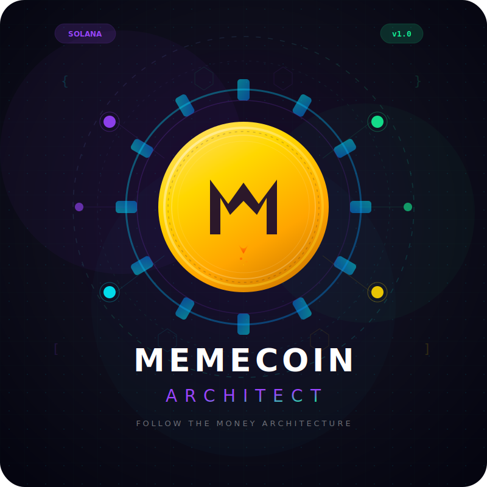

<p align="center">
  
</p>

<h1 align="center">Memecoin Architect</h1>

<p align="center">
  <strong>The most comprehensive memecoin launch system ever built.</strong><br/>
  Production-grade token architecture for Solana, Base, and Ethereum.
</p>

<p align="center">
  
  
  
  
  
  
</p>

<p align="center">
  
  
  
  
  
  
</p>

---

<p align="center">
  <strong>This is NOT a "mint & pray" system.</strong><br/>
  This is <strong>follow-the-money architecture</strong>.
</p>

---

## Table of Contents

- [Why Memecoin Architect](#why-memecoin-architect)
- [What You Get](#what-you-get)
- [Architecture Overview](#architecture-overview)
- [Quick Start](#quick-start)
- [The 4-Phase Workflow](#the-4-phase-workflow)
- [11 Modules Deep Dive](#11-modules-deep-dive)
- [5 Anchor Smart Contracts](#5-anchor-smart-contracts)
- [Aura Dashboard Engine (55 Components)](#aura-dashboard-engine-55-components)
- [Python Engine (90-99% Token Reduction)](#python-engine-90-99-token-reduction)
- [CLI Reference (12 Commands)](#cli-reference-12-commands)
- [MCP Tools Reference (9 Tools)](#mcp-tools-reference-9-tools)
- [Security Architecture](#security-architecture)
- [Vigilante Security Suite](#vigilante-security-suite)
- [Usage Examples & Samples](#usage-examples--samples)
- [Backtest Results](#backtest-results)
- [File Structure](#file-structure)
- [Installation & Setup](#installation--setup)
- [Configuration](#configuration)
- [Trigger Words](#trigger-words)
- [FAQ](#faq)
- [Contributing](#contributing)
- [License](#license)

---

## Why Memecoin Architect

The memecoin space in 2026 is a battlefield. 99% of launches fail because they lack:

1. **Proper tokenomics** — infinite mints, no burn mechanics, team can rug
2. **Security** — front-run by MEV bots, sniped at launch, metadata hijacked
3. **Infrastructure** — no dashboard, no CI/CD, manual deploys, broken scripts
4. **Growth strategy** — no listing plan, no KOL outreach, no content pipeline
5. **Governance** — single wallet controls everything, no timelock, no multi-sig

Memecoin Architect solves ALL of these. It's a complete system — from market research to post-launch growth — designed by someone who's seen hundreds of launches fail and studied the few that succeeded.

### The Core Philosophy

```
┌─────────────────────────────────────────────────────────────────┐
│                                                                  │
│   "Every successful memecoin is a business disguised as a joke"  │
│                                                                  │
│   This system treats it like one:                                │
│   - Fixed supply (trust)                                         │
│   - Deterministic burns (deflation)                              │
│   - Multi-sig treasury (governance)                              │
│   - Real dashboard (transparency)                                │
│   - Security-first launch (protection)                           │
│   - Growth pipeline (sustainability)                             │
│                                                                  │
└─────────────────────────────────────────────────────────────────┘
```

---

## What You Get

| Component | Count | Description |
|-----------|-------|-------------|
| **Smart Contracts** | 5 Anchor programs | Token mint, burn controller, treasury vault, governance, emergency pause |
| **Dashboard** | 55 template files | Next.js 15 glassmorphic UI with 3 route groups and 6 data hooks |
| **Reference Docs** | 10 guides | Tokenomics, security, cross-chain, regulatory, execution master prompt |
| **Scripts** | 9 scripts | Deploy, DEX integration, security hardening, marketing |
| **Python Engine** | 10 modules (1,939 lines) | CLI + MCP server with byte-offset indexing |
| **CLI Commands** | 12 commands | Build, search, extract, generate, serve |
| **MCP Tools** | 9 tools | Real-time query interface for Claude |
| **Index Entries** | 348 entries | Searchable across 80 source files |
| **Total Size** | 924KB | Everything you need, nothing you don't |

---

## Architecture Overview

```
┌──────────────────────────────────────────────────────────────────┐
│                    MEMECOIN ARCHITECT v1.0                         │
├──────────────────────────────────────────────────────────────────┤
│                                                                   │
│  ┌─────────┐   ┌──────────┐   ┌──────────┐   ┌───────────┐     │
│  │ Phase 0 │──→│ Phase 1  │──→│ Phase 2  │──→│ Phase 3   │     │
│  │Research │   │ Design   │   │ Execute  │   │ Deploy    │     │
│  └─────────┘   └──────────┘   └──────────┘   └───────────┘     │
│       │              │              │               │            │
│       v              v              v               v            │
│  MEMECOIN_      11 Modules     Full Repo      Pre/Post         │
│  BRIEF.md      Tokenomics     Generation     Checklists        │
│                Burns,Treas    Contracts       CI/CD Pipeline    │
│                Gov,UI,Sec     Dashboard                         │
│                               Scripts                           │
│                                                                   │
│  ┌──────────────────────────────────────────────────────────┐   │
│  │                   PYTHON ENGINE                            │   │
│  │  ┌────────┐  ┌──────────┐  ┌──────────┐  ┌───────────┐  │   │
│  │  │Indexer │→ │ Index    │→ │Extractor │→ │ CLI/MCP   │  │   │
│  │  │(parser)│  │ (348 ent)│  │(bytes)   │  │ (12+9)    │  │   │
│  │  └────────┘  └──────────┘  └──────────┘  └───────────┘  │   │
│  │  90-99% token reduction | zero external dependencies      │   │
│  └──────────────────────────────────────────────────────────┘   │
│                                                                   │
│  ┌─────────────────────────┐  ┌──────────────────────────────┐  │
│  │  5 ANCHOR CONTRACTS     │  │  55 AURA DASHBOARD FILES     │  │
│  │  token_mint.rs          │  │  Next.js 15 + Tailwind 4     │  │
│  │  burn_controller.rs     │  │  TanStack Query + Recharts   │  │
│  │  treasury_vault.rs      │  │  Framer Motion + Wallet      │  │
│  │  governance_multisig.rs │  │  3 route groups (landing,    │  │
│  │  emergency_pause.rs     │  │  dashboard, admin)           │  │
│  └─────────────────────────┘  └──────────────────────────────┘  │
│                                                                   │
└──────────────────────────────────────────────────────────────────┘
```

---

## Quick Start

### Option 1: Natural Language (Recommended)

Just talk to Claude with the skill activated:

```
You: "I want to launch a memecoin on Solana called $DOGE2026"

Claude: [Activates Memecoin Architect]
        → Runs Phase 0 market research
        → Produces MEMECOIN_BRIEF.md
        → Designs tokenomics (Module 1-7)
        → Generates full repo (Phase 2)
        → Provides deploy checklist (Phase 3)
```

### Option 2: Direct Execution Mode

```
You: "execution mode" or "DO IT ALL" or "generate full repo"

Claude: → Generates 71+ files instantly
        → 5 Anchor programs
        → 55 dashboard templates
        → 9 deploy/security scripts
        → CI/CD pipeline
        → Marketing assets
```

### Option 3: CLI (Power Users)

```bash
cd ~/.claude/skills/memecoin-architect

# Build the search index
python3 -m engine build-index

# Search for anything
python3 -m engine search "treasury governance"

# Generate the entire dashboard
python3 -m engine generate-dashboard ./my-project/frontend

# Generate all contracts
python3 -m engine generate-contracts ./my-project/programs

# Generate EVERYTHING
python3 -m engine generate-manifest ./my-project
```

---

## The 4-Phase Workflow

### Phase 0: Research & Brainstorm (Entry Point)

**Every project starts here.** Before writing a single line of code, you research the market.

```
┌─────────────────────────────────────────────────────┐
│               PHASE 0: RESEARCH ENGINE               │
├─────────────────────────────────────────────────────┤
│                                                      │
│  R1: Market Landscape Analysis                       │
│      └─ Real-time web search for trends, volume     │
│                                                      │
│  R2: Competitor Deep-Dive                            │
│      └─ 3-5 competitors analyzed (MC, holders, LP)  │
│                                                      │
│  R3: Chain Selection                                 │
│      └─ Weighted scoring matrix with elimination     │
│                                                      │
│  R4: Naming & Branding Brainstorm                    │
│      └─ 5-10 candidates scored on memorability       │
│                                                      │
│  R5: Utility & Narrative Design                      │
│      └─ Launch hook, retention model, revenue        │
│                                                      │
│  OUTPUT: MEMECOIN_BRIEF.md                           │
│  GATE: GO / CAUTION / NO-GO                          │
│                                                      │
└─────────────────────────────────────────────────────┘
```

**Trigger words:** "research", "brainstorm", "phase 0", "market analysis"

**Output:** `MEMECOIN_BRIEF.md` — a structured research document that feeds all downstream phases.

**Go/No-Go Gate:** Phase 0 produces a GO / CAUTION / NO-GO recommendation. A NO-GO halts the project with clear reasoning and saves you from wasting time and money on a doomed launch.

### Phase 1: Design (11 Modules)

Design the complete tokenomics, security model, governance roadmap, dashboard UI, marketing strategy, and growth plan. All 11 modules are configured based on the MEMECOIN_BRIEF.md from Phase 0.

### Phase 2: Execute (Full Repo Generation)

One command generates everything: Anchor programs, dashboard templates, deploy scripts, CI/CD, marketing assets. The Python engine handles this with 99.7% token savings compared to having Claude read and write every file individually.

### Phase 3: Deploy

Three-stage deployment with checklists:
1. **Pre-Deploy:** Security validation, authority checks, LP calculations
2. **Deploy:** Anchor build + deploy, LP creation, metadata lock
3. **Post-Deploy:** Authority verification, DEXScreener submission, monitoring setup

---

## 11 Modules Deep Dive

### Module 1: Token Layer

Fixed supply architecture — the foundation of trust.

| Parameter | Value | Enforcement |
|-----------|-------|-------------|
| Total Supply | 1,000,000,000 (configurable) | Fixed at construction |
| Mint Authority | ONE-TIME ONLY | Revoked after mint |
| Decimals | 9 (Solana standard) | Immutable |
| Owner Privileges | NONE post-deploy | Verified on-chain |

**Distribution Model (Anti-Rug):**

| Allocation | Percentage | Rules |
|------------|-----------|-------|
| Liquidity Pool | 70% | LP tokens locked or burned |
| Community/Airdrop | 15% | Fair distribution, no single wallet > 2% |
| Treasury DAO | 10% | Multi-sig + DAO gated |
| Team (VESTED) | 5% | 12-month linear vesting with cliff |

### Module 2: Burn Mechanics

Burns are **mechanical, not emotional**. No manual burn buttons. No "community votes to burn."

**Deterministic Burn Triggers:**
- Trade-based: X% of every swap automatically burned
- Volume-based: Milestone burns at volume thresholds
- Activity-based: Burns tied to NFT mints, votes, game actions
- Treasury buyback: Programmatic buy + burn from DEX

```
BURN FLOW:
┌──────────┐    ┌──────────────┐    ┌──────────┐
│ Trade    │───→│ burn_controller│───→│ Token    │
│ happens  │    │ .rs checks   │    │ burned   │
│          │    │ triggers     │    │ forever  │
└──────────┘    └──────────────┘    └──────────┘
```

### Module 3: Treasury System

Multi-sig treasury with DAO governance — the money is protected, not rug-able.

```
TREASURY POLICY — MANDATORY:
┌─────────────────────────────────────────────────────┐
│  DEFAULT: NO NEW MINTS EVER                          │
│  Total supply is FIXED at initialization.            │
│  Treasury only manages ALREADY MINTED tokens.        │
│  All disbursements require multi-sig approval.       │
└─────────────────────────────────────────────────────┘
```

**Buyback + Burn Flow (Market Support):**

```
┌─────────────┐    ┌─────────────┐    ┌─────────────┐
│ Treasury    │───→│ Buy on DEX  │───→│ Burn tokens │
│ triggers    │    │ (Raydium/   │    │ permanently │
│ buyback     │    │  Jupiter)   │    │             │
└─────────────┘    └─────────────┘    └─────────────┘
```

### Module 4: Liquidity Engine

**DEX Stack:** Raydium (AMM) + Jupiter (aggregator)

**LP Protection:**
- LP Lock: 6-12 months minimum (configurable)
- Auto LP burn on milestones (holder count, volume)
- No withdraw authority — LP tokens are burned or locked in a timelock contract
- JITO-bundled LP addition for private mempool launch (anti-sniper)

### Module 5: Governance Roadmap

Progressive decentralization — start centralized for speed, end decentralized for trust.

| Phase | Timeline | Control Model |
|-------|----------|---------------|
| Phase 1 | Launch → 3 months | Core team + 3-of-5 multisig |
| Phase 2 | 3-6 months | Snapshot voting (token-weighted) |
| Phase 3 | 6+ months | On-chain DAO (Realms/SPL Governance) |

### Module 6: Emergency Controls

Time-limited, auditable emergency powers for genuine crises only.

| Control | Duration | Authority | Logged |
|---------|----------|-----------|--------|
| Trading Pause | Max 72 hours | Guardian multisig | On-chain |
| LP Freeze | Max 48 hours | Guardian multisig | On-chain |
| Treasury Lock | Max 7 days | Guardian multisig | On-chain |
| Oracle Anomaly | Automatic | Smart contract | On-chain |

**Cannot:** Mint new tokens, withdraw LP, change supply, modify burn rules.

### Module 7: Stablecoin-Adjacent Mechanics (Optional)

Treasury-backed soft floor WITHOUT becoming a regulated stablecoin.

**Safety Rules (Critical — Legal Compliance):**
- No fixed dollar peg
- No guaranteed redemption at face value
- No yield promises or APY claims
- Disclosures baked into metadata and UI

### Module 8: "Aura" Dashboard Engine

55-component glassmorphic Next.js 15 dashboard with three views.

**Route Groups:**

| Route | Access | Purpose |
|-------|--------|---------|
| `(landing)` | Public | Marketing page — token stats, value prop |
| `(dashboard)` | Wallet optional | Holder dashboard — bento grid with live data |
| `(dashboard)/admin` | Wallet required | Admin panel — treasury, governance, emergency |

**6 Data Hooks (TanStack Query):**
- `useTokenMetrics` — MintState + BurnState PDAs
- `useTreasuryData` — TreasuryState PDA
- `useGovernanceData` — GovernanceState PDA
- `useEmergencyStatus` — EmergencyState PDA
- `usePriceData` — Jupiter Price API v2
- `useRoleGuard` — Client-side wallet role check

**14 UI Components:**
BurnMeter, TreasuryCard, PriceChart, HolderMap, LPStatus, SupplyTicker, ProposalList, EmergencyControls, BuybackBurnForm, RoleGuard, TransactionButton, AnimatedNumber, Sparkline, StatusBadge

**Stack:** Next.js 15, Tailwind CSS 4, TanStack Query, Recharts, Framer Motion, @solana/wallet-adapter

### Module 9: "Narrative Forge" Content Engine

AI-powered marketing asset generator that produces launch-ready content.

**Outputs:**
- 5-part X/Twitter launch thread (AIDA framework)
- 10 DALL-E/Midjourney meme prompts (style-matched)
- Telegram/Discord announcement templates
- Whitepaper PDF structure
- Brand guide + media kit (colors, fonts, voice)

### Module 10: "Vigilante" Security Suite

MEV and sniper protection for fair launches.

| Protection | What It Does |
|-----------|-------------|
| JITO-bundled LP | Private mempool LP addition — bots can't see it |
| Anti-bot swap caps | Time-weighted limits for first 30 minutes |
| Metadata lock | One-click immutability for name/symbol/URI |
| Authority verify | 6-check post-deploy validator with CI exit codes |
| Sandwich mitigation | Slippage guidance + MEV-aware routing |

### Module 11: "Propulsion" Post-Launch Growth

30-day automated growth pipeline.

**Week 1:** DEXScreener profile, DEXTools listing, Jupiter strict list application
**Week 2:** CoinGecko submission, CoinMarketCap application
**Week 3:** KOL research briefs, outreach templates, partnership proposals
**Week 4:** Community growth playbook, retention mechanics, second narrative push

---

## 5 Anchor Smart Contracts

All contracts are in `scripts/anchor_contracts/` and use the Anchor framework for Solana.

### token_mint.rs
Fixed supply token with one-time mint. After construction, mint authority is revoked and supply is permanently fixed. Includes transfer hooks for burn-on-trade mechanics.

### burn_controller.rs
Deterministic burn engine with configurable triggers. Supports trade-percentage burns, volume-threshold burns, and treasury-initiated buyback burns. All burns are logged as events with timestamps and amounts.

### treasury_vault.rs
PDA-controlled treasury vault with multi-sig proposal system. Supports deposit, withdrawal (via approved proposals), and automated buyback+burn execution. Tracks all movements on-chain.

### governance_multisig.rs
M-of-N multi-sig with configurable threshold. Supports owner management, threshold changes, and configuration proposals. All changes go through timelock delay for security.

### emergency_pause.rs
Time-limited pause system with guardian voting. Maximum pause duration enforced on-chain. De-escalation requires guardian consensus. All actions logged with timestamps.

---

## Aura Dashboard Engine (55 Components)

The Aura dashboard is a complete Next.js 15 application with glassmorphic design language.

### Key Design Decisions

- **Route Groups** for clean URL separation: `/` (landing), `/dashboard` (holder), `/admin` (wallet-gated)
- **TanStack Query** for smart caching + real-time refetch of on-chain data
- **Framer Motion** for smooth animations (burn meter, supply ticker, price chart)
- **Recharts** for data visualization (treasury balance, burn rate, holder distribution)
- **@solana/wallet-adapter** for wallet connection (Phantom, Solflare, Backpack)
- **Role Guard** component for client-side access control (admin routes require signer/guardian wallet)

### File Structure

```
templates/aura/
├── app/
│   ├── layout.tsx                    # Root layout + providers
│   ├── globals.css                   # Aura design tokens
│   ├── (landing)/
│   │   ├── page.tsx                  # Public marketing page
│   │   └── components/              # Hero, stats, CTA sections
│   ├── (dashboard)/
│   │   ├── page.tsx                  # Holder bento grid dashboard
│   │   ├── components/              # BurnMeter, TreasuryCard, etc.
│   │   └── admin/
│   │       ├── page.tsx              # Admin panel
│   │       └── components/          # ProposalList, Emergency, etc.
├── components/
│   ├── wallet/WalletProvider.tsx     # Wallet adapter setup
│   ├── ui/AnimatedNumber.tsx         # Animated counter
│   ├── ui/Sparkline.tsx              # Inline chart
│   ├── ui/StatusBadge.tsx            # Status indicator
│   └── ui/TransactionButton.tsx      # TX confirmation flow
├── hooks/
│   ├── useTokenMetrics.ts            # Supply, burned, rate
│   ├── useTreasuryData.ts            # Balance, proposals
│   ├── useGovernanceData.ts          # Owners, threshold
│   ├── useEmergencyStatus.ts         # Pause state
│   ├── usePriceData.ts              # Jupiter price API
│   └── useRoleGuard.ts              # Wallet role check
└── lib/
    ├── anchor-client.ts              # IDL + program connection
    ├── constants.ts                  # Program IDs, RPC, config
    └── utils.ts                      # Formatting helpers
```

---

## Python Engine (90-99% Token Reduction)

The Python engine is the secret weapon. Instead of loading 924KB of source files into Claude's context window (which costs ~230,000 tokens), the engine indexes everything into a searchable database and serves only what's requested.

### How It Works

```
TRADITIONAL APPROACH (without engine):
┌──────────────────────────────────────────────┐
│ Claude reads 80 files = ~230,000 tokens      │
│ Most of it is not needed for the query       │
│ Context window fills up fast                 │
│ Expensive and slow                           │
└──────────────────────────────────────────────┘

MEMECOIN ARCHITECT ENGINE:
┌──────────────────────────────────────────────┐
│ Step 1: build-index (once)                   │
│   → Parses 80 files (4 formats)              │
│   → Records byte offsets for 348 entries     │
│   → Saves to data/index.json                 │
│                                              │
│ Step 2: query (per request)                  │
│   → Searches index in memory                 │
│   → Reads ONLY the needed bytes from disk    │
│   → Returns ~200-800 tokens per query        │
│   → 90-99% savings                           │
└──────────────────────────────────────────────┘
```

### Token Savings Breakdown

| Operation | Without Engine | With Engine | Savings | Reduction |
|-----------|---------------|-------------|---------|-----------|
| Extract 1 contract | ~10,000 tokens | ~800 tokens | 9,200 | **92%** |
| Generate dashboard (55 files) | ~60,000 tokens | ~200 tokens | 59,800 | **99.7%** |
| Search for burn mechanics | ~15,000 tokens | ~500 tokens | 14,500 | **96.7%** |
| List all components | ~5,000 tokens | ~300 tokens | 4,700 | **94%** |
| Full repo generation (71 files) | ~150,000 tokens | ~500 tokens | 149,500 | **99.7%** |
| **Cumulative session** | **~240,000** | **~2,300** | **237,700** | **99%** |

### Engine Architecture

```
engine/
├── __init__.py      (2 lines)    Package marker + version
├── __main__.py      (13 lines)   Entry point: python3 -m engine <cmd>
├── schema.py        (103 lines)  Dataclasses: Index, Section, Template, etc.
├── indexer.py       (498 lines)  Multi-format parser (md/rs/tsx/ts/sh)
├── extractor.py     (249 lines)  Byte-offset targeted extraction
├── searcher.py      (134 lines)  Fuzzy search with relevance scoring
├── generator.py     (240 lines)  Template instantiation + brief overrides
├── cli.py           (321 lines)  12 CLI subcommands (argparse)
├── tracker.py       (92 lines)   Token usage JSONL logger
└── mcp_server.py    (287 lines)  stdio JSON-RPC 2.0 server (9 tools)
                    ─────────
                    1,939 lines total | zero external dependencies
```

---

## CLI Reference (12 Commands)

All commands run from `~/.claude/skills/memecoin-architect/` and output structured JSON.

### `build-index` — Build the Search Index

```bash
python3 -m engine build-index
```

Parses all 80 source files across 4 formats (markdown, Rust, TypeScript/TSX, scripts) and generates `data/index.json` with byte offsets for 348 entries.

**Output:**
```json
{
  "status": "ok",
  "command": "build-index",
  "index_path": "data/index.json",
  "stats": {
    "total_files": 80,
    "total_bytes": 437891,
    "total_sections": 279,
    "total_templates": 55,
    "total_contracts": 5,
    "total_scripts": 9
  }
}
```

### `check-index` — Validate Index Health

```bash
python3 -m engine check-index
```

Checks if the index is fresh (source files haven't changed since last build) and reports integrity statistics.

### `search <query>` — Fuzzy Search

```bash
python3 -m engine search "treasury governance"
python3 -m engine search "burn" --category contracts
python3 -m engine search "hook" --limit 5
```

Searches across all 348 indexed entries with fuzzy matching and relevance scoring.

**Parameters:**
- `query` (required) — search terms
- `--category` (optional) — filter: `sections`, `templates`, `contracts`, `scripts`
- `--limit` (optional, default: 10) — max results

### `list <category>` — List All Entries

```bash
python3 -m engine list templates    # 55 entries
python3 -m engine list contracts    # 5 entries
python3 -m engine list references   # 249 entries
python3 -m engine list scripts      # 9 entries
python3 -m engine list sections     # 279 entries
```

### `extract <entry-id>` — Extract Content by ID

```bash
python3 -m engine extract contracts/treasury_vault
python3 -m engine extract "templates/app/(dashboard)/page.tsx"
python3 -m engine extract "scripts/security/jito_lp_add.ts"
```

Returns the full content of an entry with token reduction statistics.

### `generate-dashboard <dir>` — Generate Aura Dashboard

```bash
python3 -m engine generate-dashboard ./frontend
```

Writes all 55 Aura template files to the output directory, applying brief overrides if a `MEMECOIN_BRIEF.md` is available.

### `generate-contracts <dir>` — Generate Anchor Programs

```bash
python3 -m engine generate-contracts ./programs
```

Writes all 5 Anchor programs with brief parameter substitution.

### `generate-marketing <dir>` — Generate Marketing Assets

```bash
python3 -m engine generate-marketing ./marketing
```

Writes narrative forge content (launch threads, meme prompts, brand guide).

### `generate-manifest <dir>` — Generate Everything

```bash
python3 -m engine generate-manifest ./my-memecoin-project
```

Writes the complete repo structure: contracts, dashboard, scripts, CI/CD, marketing — all 71+ files.

### `apply-brief <path>` — Validate a MEMECOIN_BRIEF.md

```bash
python3 -m engine apply-brief ./MEMECOIN_BRIEF.md
```

Loads and validates a brief file, extracting override parameters (token name, ticker, supply, program IDs, etc.).

### `token-report` — View Token Savings

```bash
python3 -m engine token-report
```

Shows cumulative token savings across all engine operations.

**Example output:**
```json
{
  "status": "ok",
  "command": "token-report",
  "total_operations": 10,
  "operations_by_type": {
    "search": 3,
    "extract": 3,
    "generate-dashboard": 1,
    "generate-contracts": 1,
    "generate-marketing": 1,
    "generate-manifest": 1
  },
  "total_tokens_used": 10209,
  "total_tokens_saved": 179854,
  "baseline_tokens": 190063,
  "reduction_pct": 94.6
}
```

### `serve` — Start MCP Server

```bash
python3 -m engine serve
```

Starts the stdio JSON-RPC 2.0 server for integration with Claude Code via `.mcp.json`.

---

## MCP Tools Reference (9 Tools)

When Claude Code starts, the `.mcp.json` file auto-registers these 9 tools:

| Tool | Parameters | Returns |
|------|-----------|---------|
| `memecoin_search` | `query` (required), `category` (optional: sections/templates/contracts/scripts) | Ranked search results with relevance scores |
| `memecoin_list_templates` | none | All 55 Aura dashboard template entries |
| `memecoin_list_contracts` | none | All 5 Anchor contract entries |
| `memecoin_list_references` | none | All reference documentation sections |
| `memecoin_extract` | `entry_id` (required) | Full content with token stats (auto-detects type from ID prefix) |
| `memecoin_extract_template` | `template_id` (required) | Template content + component type, exports, route group |
| `memecoin_generate_dashboard` | `output_dir` (required), `brief_path` (optional) | Writes 55 files, returns manifest |
| `memecoin_generate_contracts` | `output_dir` (required), `brief_path` (optional) | Writes 5 programs, returns manifest |
| `memecoin_index_status` | none | Index stats, freshness check, entry counts |

---

## Security Architecture

### Smart Contract Security
- **No infinite mint** — supply is fixed at construction, mint authority revoked
- **Deterministic burns** — all burn triggers are on-chain rules, not admin decisions
- **Multi-sig treasury** — M-of-N approval required for every disbursement
- **Timelock governance** — all configuration changes have mandatory delay periods
- **Emergency powers are time-limited** — max 72h pause, logged on-chain, cannot mint
- **PDA-controlled vaults** — no private key holds treasury funds
- **Checked arithmetic** — Anchor's built-in overflow protection on all operations

### Engine Security
- **setattr injection blocked** — only known fields accepted during index deserialization
- **Path traversal protection** — all file reads validated against skill directory boundary using `Path.resolve().relative_to()`
- **Output path validation** — blocks writes to system directories: `/etc`, `/usr`, `/bin`, `/sbin`, `/var`, `/System`, `/Library`, `/private/etc`, `/private/var`
- **Narrowed exception handling** — specific exception types caught, internal errors hidden from clients
- **Zero external dependencies** — entire engine uses Python stdlib only: json, argparse, pathlib, dataclasses, re, hashlib, datetime, difflib
- **Thread-safe logging** — file locking (flock/msvcrt) for concurrent JSONL writes

---

## Vigilante Security Suite

### JITO-Bundled LP Addition (`scripts/security/jito_lp_add.ts`)

Adds liquidity through JITO's private mempool so MEV bots and snipers cannot front-run the LP creation. The transaction lands in a bundle that is invisible to the public mempool.

### Metadata Lock (`scripts/security/lock_metadata.ts`)

One-click script to make token metadata immutable (name, symbol, URI). Supports both Metaplex and Token-2022 metadata standards. Prevents post-launch metadata hijacking.

### Authority Verification (`scripts/security/verify_authorities.ts`)

6-check post-deploy validator that verifies:
1. Mint authority is revoked (null)
2. Freeze authority is revoked (null)
3. Metadata is immutable
4. LP tokens are locked/burned
5. Treasury is PDA-controlled
6. No unexpected token accounts exist

Returns CI-compatible exit codes (0 = pass, 1 = fail) for integration into GitHub Actions.

---

## Usage Examples & Samples

### Example 1: Research a New Memecoin Idea

```
You: "I'm thinking about launching a dog-themed memecoin on Solana.
      The name is $BARKCHAIN. Run phase 0 research."

Claude: [Activates Phase 0]
        → Searches current memecoin market trends
        → Analyzes 5 dog-themed competitor tokens
        → Scores Solana vs Base vs Ethereum for this launch
        → Generates 8 name alternatives with scoring
        → Designs utility narrative (bark-to-earn, community voting)
        → Produces MEMECOIN_BRIEF.md with GO recommendation
```

### Example 2: Generate Just the Dashboard

```
You: "Generate the Aura dashboard for $BARKCHAIN with program ID
      BARKxxxxxxxxxxxxxxxxxxxxxxxxxxxxxxxxxxxxxxxxx"

Claude: [Uses memecoin_generate_dashboard MCP tool]
        → Writes 55 files to specified directory
        → Substitutes program ID, token name, ticker
        → Applies glassmorphic design tokens
        → Returns file manifest with token savings
```

### Example 3: Search and Extract Specific Content

```bash
# Find everything about burn mechanics
python3 -m engine search "burn mechanics"

# Output:
{
  "results": [
    {"id": "burn_mechanics", "score": 0.967, "category": "sections"},
    {"id": "contracts/burn_controller", "score": 0.891, "category": "contracts"},
    {"id": "vigilante_security/anti_bot", "score": 0.634, "category": "sections"}
  ]
}

# Extract the burn controller contract
python3 -m engine extract contracts/burn_controller

# Output: Full Rust source code with token stats
```

### Example 4: Full Repo Generation with Brief

```bash
# Apply your project brief
python3 -m engine apply-brief ./MEMECOIN_BRIEF.md

# Generate everything
python3 -m engine generate-manifest ./barkchain-repo --brief ./MEMECOIN_BRIEF.md

# Check what was generated
ls -la ./barkchain-repo/
# → programs/       (5 Anchor contracts)
# → frontend/       (55 dashboard files)
# → scripts/        (deploy, security, dex)
# → .github/        (CI/CD workflows)
# → marketing/      (narrative forge)
```

---

## Backtest Results

The entire system has been through a comprehensive 4-phase GOD MODE backtest.

```
┌────────────────────────────────────────────────────────────────┐
│             MEMECOIN ARCHITECT — GOD MODE BACKTEST              │
├──────────────────────────┬──────────┬─────────────────────────┤
│ PHASE                    │ RESULT   │ DETAILS                 │
├──────────────────────────┼──────────┼─────────────────────────┤
│ #1 CLI Commands (19)     │ 19/19 P  │ All 12 subcommands      │
│ #2 MCP Tools (9)         │  9/9  P  │ All 9 JSON-RPC tools    │
│ #3 Security (10)         │ 10/10 P  │ Injection, path, except │
│ #4 Index Integrity (10)  │ 10/10 P  │ Paths, offsets, dupes   │
├──────────────────────────┼──────────┼─────────────────────────┤
│ TOTAL                    │ 48/48 P  │ 0 CRITICAL ISSUES       │
└──────────────────────────┴──────────┴─────────────────────────┘

 P = PASSED

Bugs found & fixed during backtest:
  1. "list references" returned 0 results → fixed category_map
  2. /etc/cron.d not blocked on macOS → added /private/etc

Final score: 48/48 PASSED | 0 CRITICAL | 2 bugs fixed
```

---

## File Structure

```
memecoin-architect/                     924KB total
├── SKILL.md                            Claude Code skill definition
├── README.md                           This file
├── logo.svg                            Project logo (800x800 SVG)
├── .mcp.json                           MCP server registration
│
├── engine/                             Python CLI + MCP server
│   ├── __init__.py                     Package init + version
│   ├── __main__.py                     Entry point
│   ├── schema.py                       Data models (103 lines)
│   ├── indexer.py                      Multi-format parser (498 lines)
│   ├── extractor.py                    Byte-offset extraction (249 lines)
│   ├── searcher.py                     Fuzzy search (134 lines)
│   ├── generator.py                    Template instantiation (240 lines)
│   ├── cli.py                          12 CLI commands (321 lines)
│   ├── tracker.py                      Token usage logger (92 lines)
│   └── mcp_server.py                   MCP server (287 lines)
│
├── data/
│   ├── index.json                      Pre-built index (348 entries)
│   └── token_log.jsonl                 Usage tracking log
│
├── references/                         10 reference documents
│   ├── phase0_research_brainstorm.md   Phase 0 research engine
│   ├── cross_chain_mirror.md           ETH/Base bridging
│   ├── tokenomics_template.md          Tokenomics design template
│   ├── security_checklist.md           Exploit surface analysis
│   ├── regulatory_notes.md             Compliance notes
│   ├── execution_master_prompt.md      Full repo generation
│   ├── aura_ui_engine.md               Dashboard design specs
│   ├── narrative_forge.md              Content strategy
│   ├── vigilante_security.md           MEV/sniper protection
│   └── propulsion_post_launch.md       Growth engine
│
├── scripts/
│   ├── anchor_contracts/               5 Rust programs
│   │   ├── token_mint.rs
│   │   ├── burn_controller.rs
│   │   ├── treasury_vault.rs
│   │   ├── governance_multisig.rs
│   │   └── emergency_pause.rs
│   ├── deploy/                         CI/CD pipeline
│   │   ├── github_actions.yml
│   │   ├── pre_deploy_checklist.md
│   │   └── post_deploy_checklist.md
│   ├── dex/                            Liquidity integration
│   │   ├── raydium_lp.sh
│   │   └── jupiter_integration.md
│   ├── security/                       Post-deploy hardening
│   │   ├── jito_lp_add.ts
│   │   ├── lock_metadata.ts
│   │   └── verify_authorities.ts
│   └── marketing/                      Content templates
│
└── templates/                          55 Aura dashboard files
    └── aura/
        ├── app/                        Next.js 15 routes
        ├── components/                 UI components
        ├── hooks/                      Data hooks
        └── lib/                        Utilities
```

---

## Installation & Setup

### Prerequisites

- Python 3.8+ (for the engine)
- Claude Code CLI (for skill activation)
- No external Python packages required (stdlib only)

### Step 1: Verify Installation

```bash
# The skill should already be at this path
ls ~/.claude/skills/memecoin-architect/SKILL.md
```

### Step 2: Build the Index

```bash
cd ~/.claude/skills/memecoin-architect
python3 -m engine build-index
```

This parses all 80 source files and creates `data/index.json` with 348 searchable entries.

### Step 3: Verify the Index

```bash
python3 -m engine check-index
```

Expected output: `"fresh": true` with 348 entries.

### Step 4: Test the Engine

```bash
# Search for something
python3 -m engine search "treasury"

# List all contracts
python3 -m engine list contracts

# Check token savings
python3 -m engine token-report
```

### Step 5: Verify MCP Server (Optional)

```bash
# Check MCP registration exists
cat ~/.claude/skills/memecoin-architect/.mcp.json

# The MCP tools auto-register when Claude Code starts
```

---

## Configuration

### Default Parameters (Locked)

These can be overridden via `MEMECOIN_BRIEF.md`:

| Parameter | Default | Override |
|-----------|---------|---------|
| Token Supply | 1,000,000,000 | Brief Section 7 |
| Decimals | 9 | Brief Section 7 |
| LP Percentage | 70% | Brief Section 7 |
| LP USDC Amount | $100,000 | Brief Section 7 |
| Distribution Wallets | 10 | Brief Section 7 |
| Burn Rate | 1% per trade | Brief Section 7 |
| Treasury Multi-sig | 3-of-5 | Brief Section 7 |
| Emergency Max Duration | 72 hours | Brief Section 7 |
| LP Lock Period | 12 months | Brief Section 7 |
| Governance Phase 2 | Month 3 | Brief Section 7 |

### Chain Selection

| Chain | Status | Use Case |
|-------|--------|----------|
| Solana | Primary (default) | 90% of successful launches, ultra-low fees |
| Base | Secondary | Institutional bridge, Coinbase ecosystem |
| Ethereum | Tertiary | Post-meme evolution, deep liquidity |
| BSC | Not recommended | Reputation issues |

---

## Trigger Words

Claude activates this skill when you mention any of these terms:

**Design & Architecture:**
memecoin design, token launch, Solana token, tokenomics, burn mechanics, treasury system, governance, anti-rug, fixed supply, distribution model

**Research & Planning:**
brainstorm, market research, competitor analysis, chain selection, phase 0, memecoin brief

**Build & Execute:**
Anchor contracts, execution mode, generate full repo, DO IT ALL, generate dashboard, generate contracts

**UI & Frontend:**
dashboard, Aura UI, glassmorphic, bento grid, holder dashboard, admin panel

**Security:**
MEV protection, sniper protection, anti-bot, JITO bundle, verify authorities, lock metadata, vigilante

**Growth & Marketing:**
post-launch, propulsion, DEXScreener, CoinGecko listing, KOL outreach, narrative forge, launch thread, brand guide, media kit

**Engine & Tools:**
build index, search content, extract contract, token report, MCP serve

---

## FAQ

### Q: Do I need to install any Python packages?
**A:** No. The entire engine uses Python standard library only. No pip install required.

### Q: Can I use this for chains other than Solana?
**A:** The primary target is Solana, but the architecture supports Base and Ethereum via the cross-chain mirror module. The Anchor contracts are Solana-specific, but the tokenomics, dashboard, and growth modules are chain-agnostic.

### Q: How do I customize the token name and parameters?
**A:** Create a `MEMECOIN_BRIEF.md` using Phase 0, or manually specify parameters in Section 7 of the brief. The generator substitutes `{{TOKEN_NAME}}`, `{{TICKER}}`, `{{TOTAL_SUPPLY}}`, `{{PROGRAM_ID}}`, and other placeholders.

### Q: Is the dashboard production-ready?
**A:** The templates are production-grade skeletons. You need to: install dependencies (`npm install`), configure your RPC endpoint and program IDs in `lib/constants.ts`, and deploy the Anchor programs. The UI components, data hooks, and routing are all functional.

### Q: What if I want to skip Phase 0?
**A:** Tell Claude "skip research" or "use defaults" and go directly to execution mode. The system will use locked defaults for all parameters.

### Q: How do I update the index after modifying source files?
**A:** Run `python3 -m engine build-index` to rebuild. Use `python3 -m engine check-index` to verify freshness.

### Q: Can I use the engine without Claude Code?
**A:** Yes. The CLI works standalone: `cd ~/.claude/skills/memecoin-architect && python3 -m engine <command>`. The MCP server is only needed for Claude Code integration.

### Q: What's the difference between `generate-manifest` and `generate-dashboard`?
**A:** `generate-manifest` generates EVERYTHING (contracts + dashboard + scripts + CI/CD + marketing). `generate-dashboard` generates only the 55 Aura dashboard files. Use `generate-manifest` for a new project, `generate-dashboard` if you only need the frontend.

---

## Contributing

This is a private skill. For issues or feature requests, contact the maintainer.

### Development Setup

```bash
cd ~/.claude/skills/memecoin-architect

# Build index
python3 -m engine build-index

# Run all CLI commands to verify
python3 -m engine check-index
python3 -m engine search "treasury"
python3 -m engine list contracts
python3 -m engine extract contracts/treasury_vault
python3 -m engine generate-dashboard /tmp/test-dashboard
python3 -m engine token-report
```

---

## License

Private skill. All rights reserved.

---

<p align="center">
  
</p>

<p align="center">
  <strong>Built with Memecoin Architect v1.0.0</strong><br/>
  <sub>Follow the money. Not the hype.</sub>
</p>
